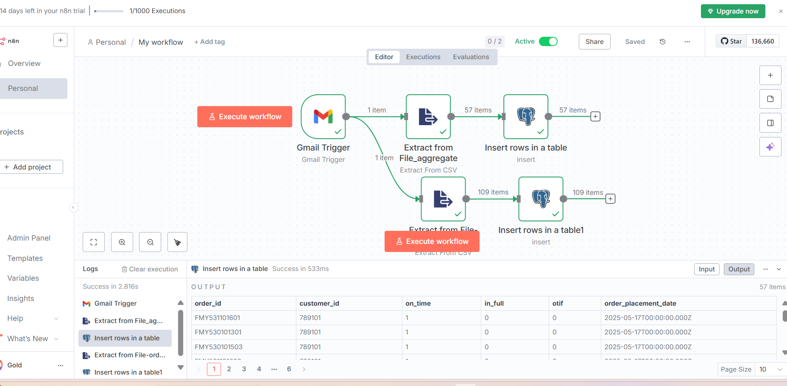
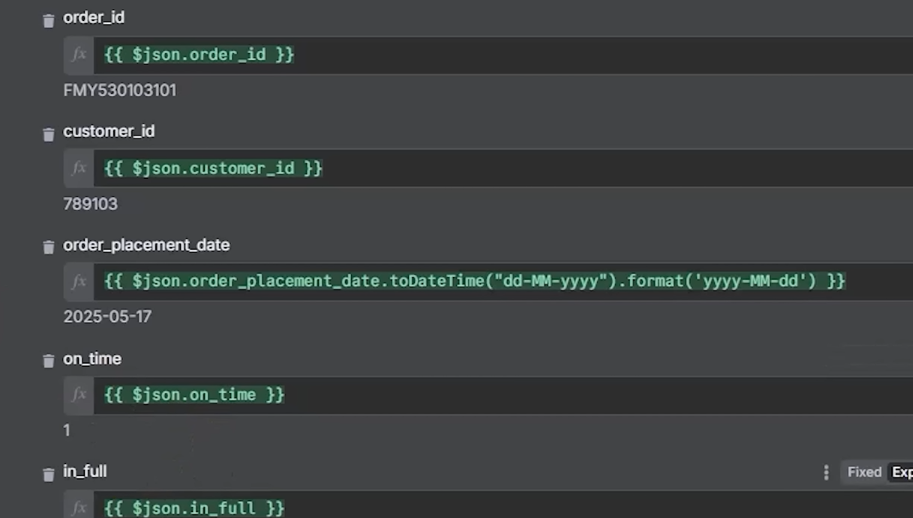
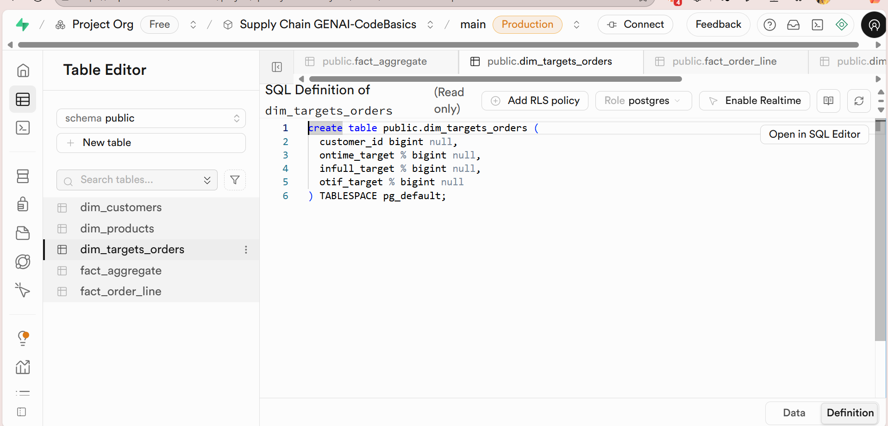
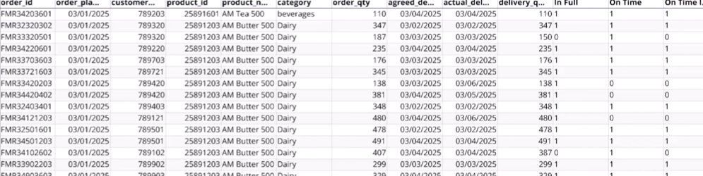
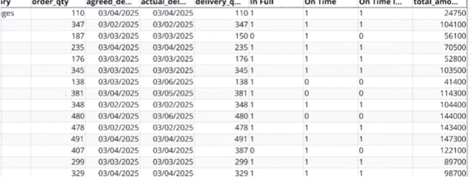

# Automated Supply Chain ETL Pipeline & AI Analytics

## 📌 Project Overview
AtliQ Mart, a Gujarat-based FMCG manufacturer, expanded operations to New Jersey, USA. Following this expansion, the supermarket faced severe supply chain and product delivery issues. 

This project solves this by establishing a localized, automated ETL data pipeline. The pipeline extracts live daily sales data via email triggers, harmonizes 4 cross-border datasets (2 from India, 2 from the USA), and ingests them into a centralized Supabase database. Finally, Quadratic AI is used to merge the data into a Fact Summary sheet and calculate 7 critical supply chain KPIs to diagnose delivery bottlenecks.

## 🛠️ Architecture & Tech Stack
* **Workflow Automation:** n8n (Local Host), Gmail API (OAuth Client ID)
* **Database, Storage & Transformation:** Supabase (PostgreSQL)
* **AI Analytics & Prompting:** Quadratic AI, Python

## ⚙️ The ETL Data Pipeline Workflow

### 1. Database Initialization (Supabase)
Before data extraction occurred, the database schema and required tables (`fact_order_line`, `dim_products`, `dim_customers`) were pre-created in the Supabase PostgreSQL database to ensure a strict structure for incoming payloads.

### 2. Extraction (n8n)
An automated n8n workflow was established on a local host to monitor a dedicated inbox every minute. 
* **Trigger:** Activates exclusively when an email arrives with the subject **"daily sales"**.
* **Extraction:** Accesses and downloads the attached CSV files using the Gmail API.
* 

### 3. Transformation & Ingestion (Supabase)
Once the files are extracted, Supabase handles the heavy lifting of formatting and ingestion:
* **Format Conversion:** Converts the raw CSV data into structured JSON format.
* **Date Standardization:** Standardizes inconsistent date formats across the US and Indian datasets using the expression `.todateformat("dd-mm-yyyy").format("yyyy-mm-dd")`. 

### 4. Data Cleaning and Insertion
* The transformed data is continuously ingested into the Supabase tables by creating tables with column names same as the email datasheets. 
Once stored, rigorous data cleaning was performed in the Supabase SQL Editor:

## 📊 AI Analytics & Data Modeling (Quadratic AI)

### The Final Fact Summary Sheet
Using Prompt Engineering in Quadratic AI, the raw tables were processed and consolidated into a unified `fact_summary` table:
* Fetched historical exchange rates via API to convert USD to INR (`price_USD * USD_INR_Rate * order_qty`).
* Cleaned IDs (stripped whitespace, removed NULLs, converted to integers).
* Merged the cleaned `fact_order_line` with `dim_products`, `dim_customers`, and the Exchange Rate table.
* Dropped intermediate columns to finalize the fact summary.

### Core Supply Chain KPIs
Using specific prompts in Quadratic AI, the following 7 critical KPIs were successfully calculated to measure service levels:
1. **Total Order Lines**
2. **Line Fill Rate**
3. **Volume Fill Rate**
4. **Total Orders**
5. **On Time Delivery %**
6. **In Full Delivery %**
7. **On Time In Full (OTIF) %**

## 💡 Business Insights & Problem Resolution
By analyzing the calculated KPIs, the following business questions were answered to provide actionable insights for stakeholders:
* **Revenue Impact:** Quantified the exact financial revenue loss attributed strictly to undelivered orders.
* **Customer Discrepancies:** Identified the specific customers (including top 5 by order value) with the most significant drops in OTIF reliability.
* **Supply Bottlenecks:** Isolated specific product categories exhibiting consistently low 'In Full' delivery rates, indicating severe inventory or supply planning issues.
* **Delivery Delays:** Calculated the average delay time for late deliveries to map logistics failures.

## 📁 Repository Navigation
* `/images`: Contains the Supabase SQL scripts used for anomaly deletion, Project screenshots, workflow nodes, and Quadratic AI dashboard outputs.
